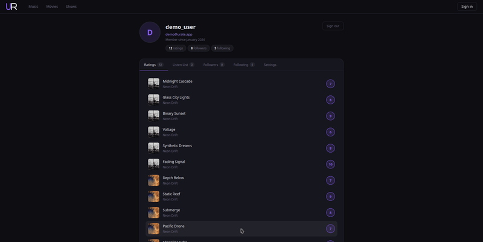
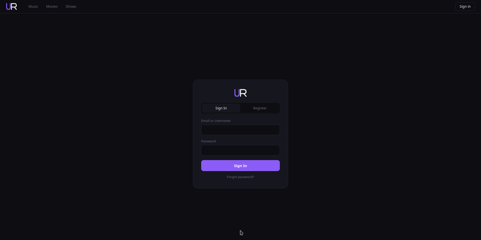

# PSI

## Table of Contents
1. [Web app](#web-app)
2. [Backend/API](#backendapi)
   
## Web app

### Demo version details
- Currently using placeholder songs, artists, playlists and profiles.  

- Pages that can not be accessed through ui are */profile* (**profile simulation**) and */user/lunar_waves* (**friend profile simulation**)

### Setting up and starting the app
#### Prerequisites
-Node installed
#### Setting up
1. Pull the code and open the URate-Web folder in the IDE of choice
2. Run npm install to install all needed files inside the folder
3. Run npm run dev to start the pplication
4. Access the app through localhost on port 3000

### Features implemented in demo
- Music recommendation, discover and my music page styling

- Search bar in discover tab

- Album and artist view

- Rating and viewing placeholder rattings visuals

- Profile page visuals

- Follower and following view

- Listen list local storage functionality

- Login/register pages

### Features to be added in demo
- Artist song edit page

- Admin and co-admin tag, artist and role management pages

- Admin testing options

## Backend/API

- Currently no API or backend is implemented
