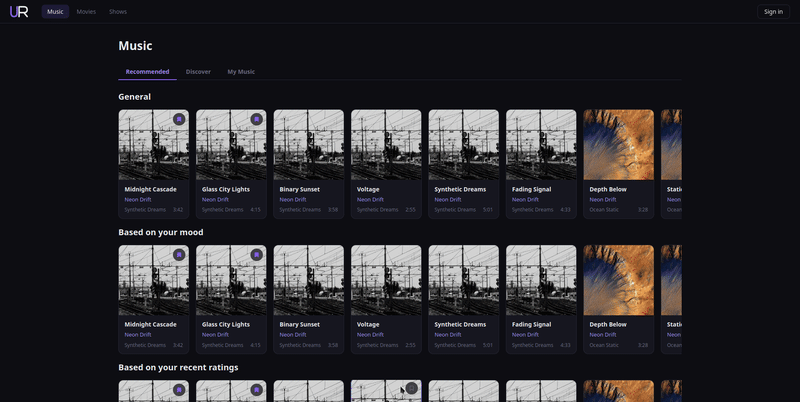
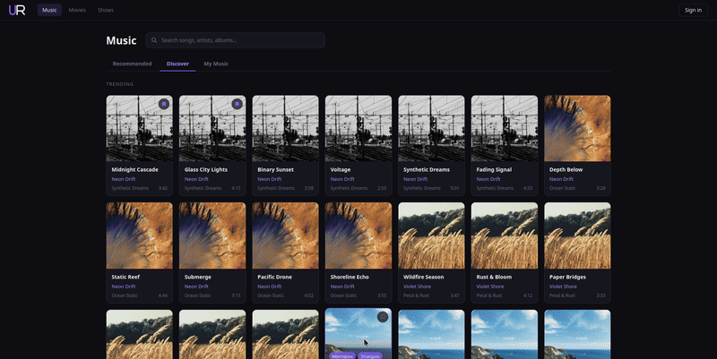

# PSI

## Table of Contents
1. [Web app](#web-app)
2. [Backend/API](#backendapi)
   
## Web app

### Demo version details
- Currently using placeholder songs, artists, playlists and profiles.  

- Pages that can not be accessed through ui are */profile* (**profile simulation**) and */user/lunar_waves* (**friend profile simulation**)

### Features implemented in demo
- Music recommendation, discover and my music page styling

- Search bar in discover tab

- Album and artist view

- Rating and viewing placeholder rattings visuals

- Profile page visuals

- Follower and following view

- Listen list local storage functionality

- Login/register pages

### Features to be added in demo
- Artist song edit page

- Admin and co-admin tag, artist and role management pages

- Admin testing options

## Backend/API

- Currently no API or backend is implemented
